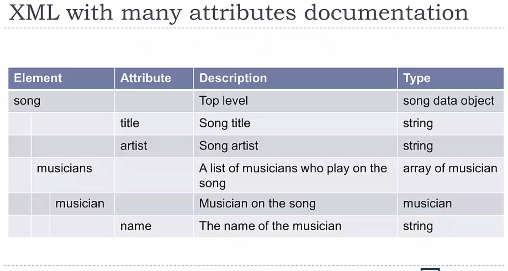
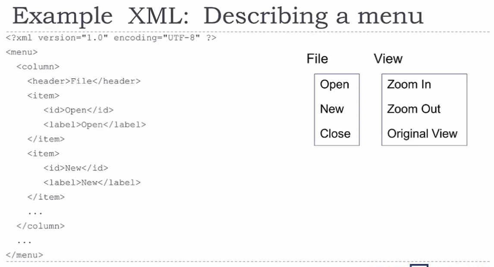

# API Documentation 1: JSON and XML for Writers

ProgrammableWeb.com lists all the publicly available web APIs to use.

Strucuted Data is data that does not fit neatly into a table.

## Data Types and Structured Data

As an API writer, one of your main tasks is to descrive data.

Each piece of data has a type, for example: integer numbers (whole numbers), decimal numbers, text, true/false (boolean), dates, &c. You can also define custom types, for example a type that captures all the data about a user.

- JSON uses three basic data types:
  - number
  - string
  - boolean

- XML only uses one type:
  - string

String
: A number of text chatacters 'strung' together.
: Enclosed in double or single quotes.
: Can have letters, numbers, punctuation, &c.
: Can have spaces.

Boolean
: Boolean math is the math of true and false. (Basically, math done with logic instead of numbers.)
: A Boolean value can only ever be 'true' or 'false'.
: Any checkbox is a boolean.

Collections

In addition to data types, structured data can have groups of data.

Two common types of collections:

- Arrays (lists)
- Dictionaries (look up tables)

Arrays

Am array is alist of data vaues. They have:

- A size (how many are in the list)
- An order (which object comes first)

Dictionaries

A dictionary is a collection of data keys and values. You use a **key** to look up the **value**, just like in a dictionary wher eyou use the work to took up the meaning.

A dictionary of US regions (keys) and number of states in that region (values) might look like this:

"West": 6, "North East": 10, "South": 8, "Midwest": 10

Notice the key is a piece of text surrounded by double quotes. After the colon, is the value.

Collections can consist of other collections.

API responses are almost aloway structured data. API requests sometimes have structured data.

see also - ToolsForWritingJSONandXML.pdf

## JSON

JavaScript Object Notation (JSON)

Basic Data Types:

- Strings
  - Hold text
  - Enclosed in single or double quotes
- Numbers
  - Booleans
  - True or false
- No quotation marks
- Null
  - No quotation marks
  - Null means "nothing"

Arrays:

- Arrays are lists
- Arrays are presented in square brackets [ ]
- Values in the [ ] are comma-separated
- Can mix data types

Objects;

- Objects are what JSON calls dictionaries
- Objects are enclosed n curly brackets { }
- Keys and values are separated by a colon :
- Each key & value pair is separated by a comma
- Keys and values can be any data type

Example: {"red": 205, "green": 123, "blue': 53}

Nesting

Nesting means that you've got arrays and objects inside each other in mulitple layers of collections.

- You can put arrays inside objects, objects inside arrays, arrays inside arrays, &c.

- Often a JSON fie is one bit object with lots of objects and arrays inside.

- Notice that the "menu": key contains two objects (two sets of { }) separated by a comma.

White Space and Indentation

- "White space" means spaces, new lines, &c. and JSON pretty much ignores them.
- White space doesn't matter (e.g., before a line, after a line, &c.)
  - Unless it's inside quotation marks
- You can have line breaks wherever you want
  - Unless it's inside quotation marks

Though formatting doesn't matter to the computer, it's better for humans reading the file if the  formatting is best practices.

- Good JSON Formatting
  - In general, add 2 to 4 spaces as an indent for every new level of brackets
  - After a comma is a good place to put a line break if you need a line break - Lots of exceptions to these ruls. Basically, make it look good and readable
  - Use JSON formatting tools

**There is no standard way to document JSON**.

### Description and Tables

Start with a one sentence description

JSON details are best documented in one or more tables

- Columns include key name (e.g. Element), Description, and Type
- Can also include additional information, like Notes

For the most part, you document **requests** and **responses** similarly, but there are slight differences.

#### JSON Responses

Create a table like this

| Element | Description | Type | Notes |
| ---- | ---- | ---- | ---- |
| . | . | . | . |

- Element: The key of the key/value pair
- Description: A description of what the element is.Usually a descriptive now or sentence fragment
- Type: Has a value of number, string, Boolean, array, or object
  - Array: Say what it is an array of
  - Object: Say what kind of ojbect it is
- Notes: Contains any additional information needed

#### JSON Requests

Create a table like this

| Element | Description | Type | Required | Notes |
| ---- | ---- | ---- | ---- | ---- |
| . | . | . | . | . |

- Same as Response table except...
- Add a **Required** column
  - Indicates whether you have to have that element
  - Fill with "Required" or "Optional"
  - If "Optional," include defaul values in **Notes** column

Using Required in the table cell means saving the developer from having to scroll up to the top of the page to see whether an element is required or not.

Nesting in Documentation

Two ways to handle nesting:

- Indentation
  - Best for cases where objects are not reused much
  - Takes up less space
- Table for each object type when you are going to reuse the same object type in many tables
  - Have a table for each type of object
  - Best for cases where objects are reused
  - Takes up more space

**Note:** Turn off the control in MS Office that automatically capitalizes the first word in a cell, or it will drive you nuts.

##### Indentation method for documenting JSON

This is the JSON object to document:

And this is the documentation. Note that there is no Notes column since no notes were necessary:

This is the JSON object to document:

This is the documentation:

**Note:** Not all JSON files have a top-level key/value pair, but both of these examples do.

##### Tables method for documenting JSON

- Each nesting level has it's own table

What goes in the Notes column?

- Add default values for optional data type in the Notes column
- Indicate if the values are limited
  - For example, "Can have these values: 'teacher', 'student', 'admin'." or "Must be between 0 and 100."
- If a value must be formatted in a specific way, include that information
  - For example, "Date is YYY-MM-DD" or "Time is YYY/MM/DD HH:MM:SS" or URL
- Any other important information

## XML

eXtensible Markup Language

XML can be used for any kind of structured data

HTML - used to create web site; XML used for structured data

Tags:

- Similar to HTML
- Start and end tags must match.
- Tag names must only be letters, numbers, and underscores (must start with a letter)
- Empty tags
  <invitees/> = <invitees></invitees>

Content

What goes between tags is called content. If content has no tags:

- Treated liks a string, even though it has no quotes
- You can use it for numbers and true/false
  - The software will convert from a string
- If content does have tags, it's called nested data

Nested Tags

You can put tags inside of tags to create nested data

For Example:

<color>
  <red>205</red>
  <green>123</green>
  <blue>52</blue>
</color>

Attributes

In addition to content, tags can have attributes

- Attributes hold simple data (a string)
- Attributes are key/value pairs
- Both are strings, but keys do not have quotes around them
  - Names must only be letters, numbers, and underscores (must start with a letter)
  - No spaces of punctuations characters
- Placed in the start take and use the format
  - key="value"
- In the most common XML designed, attributes are not used for data
- Used to indicate some property about the data (metadata)
  - Examples of using attributes as metadata
  - <filesize unit="kB'>34.6</filesize>
  - <cost currency="USD">43.23</cost>
  - projectedValue decimals="2"> confidence="5"> 23.45</projectedValues>
- Attributes are **not** used when JSON and XML are used together; attributes are only used when the API is XML only.

The first line of an XML file indicaes that it is an XML file, says what version, character encoding, &c., and is optional so you don't always see it. As a writer, you don't need to document the first line of an XML file.

Example: <?xml version="1.0" encoding=UTF-8" standalone="no" ?>

Comments

- XML can have comments just like HTML
- Comments start with <!--
- Comments end with -->

Namespaces

each type of tag in a XML file should have a unique name

- However, you might hae a tag ame mean one thing in one context and something else in a different context
- for this, you use namespaces to uniquely identify each tag
- A namespace is just a string
- The tag name has a "namespace:" prefix
- Example: <sdkbridge:onlineCourse>

White Space and Indentation

- "White space" means spaces, new lines, &c. and XML pretty much ignores them.
- White space doesn't matter (e.g., before a line, after a line, &c.)
  - Unless it's inside quotation marks
- Good XML formatting:
  - In general, add a 2 to 3 space indent for every new level of brackets
  - If the content is getting too long, add a line break
  - Tags that do not contain other tags can have start and end tags on the same line
  - Tags that contain other tage should be on their own line

Schemas

XML files can be described with a schema

- The schema describes teh structure of the XML file
- Schema files are called XSD files (XML Schema Definition)
- Describes what the tags, attributes, and types are
  - XSD wont' be covered in this course
  - XSD files are in XML
  - It's pretty easy to figure out how they work
- Can be very helpfulin documentin XML because they contain almost all the information you need for your tables. Exception: descriptions. Descriptions are optional in XSD and are rarely included by developers.

### Documenting XML

**There is no standard way to document XML**.

API request can often use either JSON or XML.

- The request specifies which format to use

- Try to create one table that documents both formats to avoid lots of redundant documentation.
  - Table columns are teh same
  - Key names and tag name should be identical
  - Types should be identical
- If an API uses both JSON and XML then typically the XML does not have attributes but instead that information is located in tags
- If you're documenting XML with attributes:
  - If only a **few** attributes, document the attributes in the **Notes** column
  - If **many** attributes, add an **Attributes** column
- Using one table per element type works well for XML

Few

Many

Simple Types

- Technically, all simple types are strings, but...
- Software will convert from a string into a number, Boolean, date, &c.
- Document the typs so that developers know what kind of conversion to use
- Applies to both content and attribute values

Complex Types

- Complex types are other elements with tags
- List the element name in the Type column

**Note:** In the Type column you'll put a link that links to the next table. See links in screenshot above.

Request and Response

Request and Response tables are similar to JSON. See the JSON discussion above.

### Using Structured Data for Documentation

There are tools that take structured data and turn it into documentation.

- When using structured data for documentation, the documentation is "machine readable"
  - Automated testing
  - Interactive documentation

Disadvantages

- Can only handle simple descriptions
  - Too many words make it very awkward-looking
- No images
  - No diagrams or screenshots
- No links
  - No links to overview materials
  - No links to other reference materials
- Best for very straightforward APIs and data
