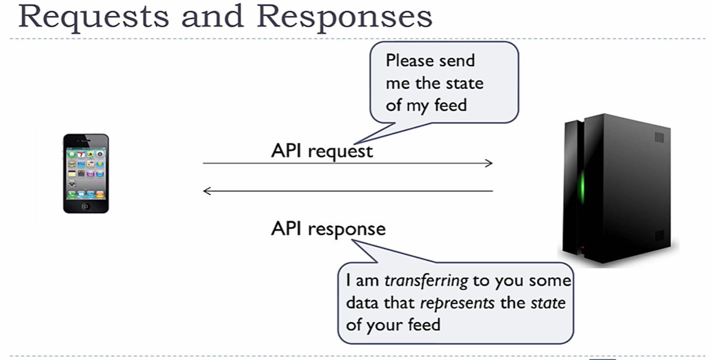
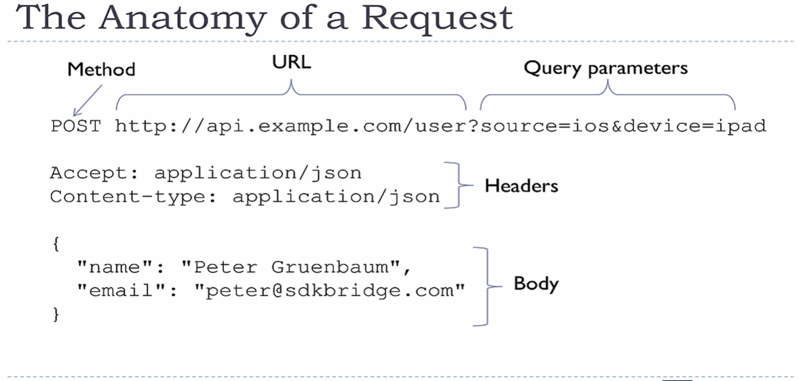
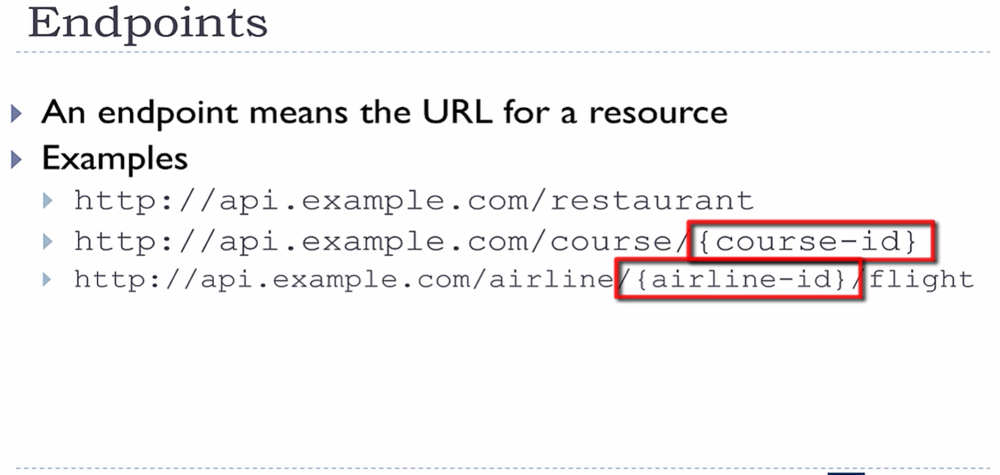
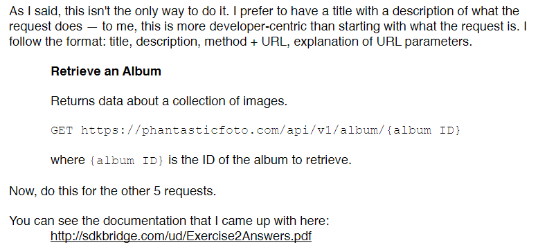
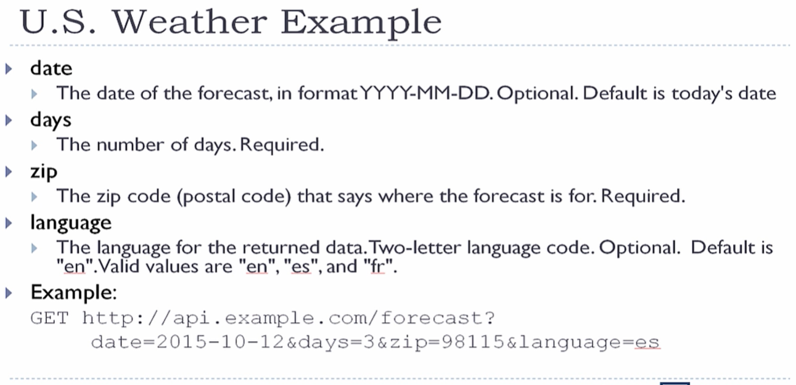
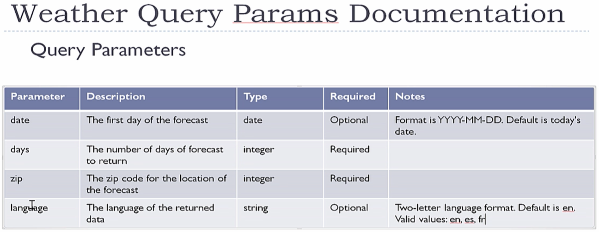
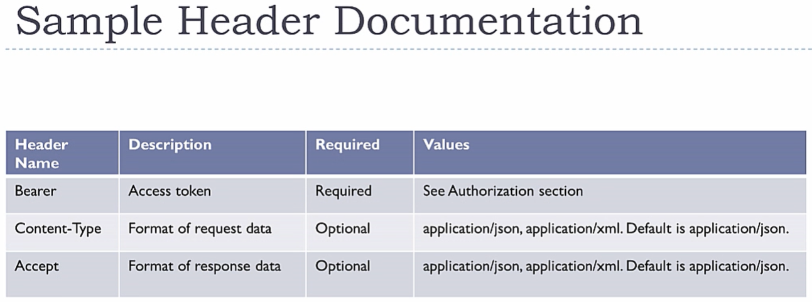

# API Documentation 2: REST for Writers

REST = **RE**presentational **S**tate **T**ransfer



APIs define how two pieces of software talk to each other

- REST is a Web API
- Web APIs define how software talks to each other over the web
  - This means client devices talking to servers
  - Web APIs consist of Requests and Responses

Authentication and Authorization

- Client device must prove its identity to the server to show that it has the authority to receive and modify data
- Authentication
  - Username and password
- Authorization
  - Use token
  - Authority to make request
- OAuth
  - Popular authorization platform
  - This course will teach you how to document for OAuth within its framework

Design Pattern vs. Protocol

- A protocoal is a pattern you need to fit exactly
  - For example, USB is a protocol. The plug must fit exactly -- size, pins, &c
- A design pattern is a set of guidelines
  - For example, a *house* is a design with many different types: colonial, adobe, craftsman, &c.

REST is a design pattern, not a protocol

- Guidelines to follow, but they are not strict
- Some APIs follow guidelines more closely than others
- Because it's a design pattern, many people call APIs that use REST "RESTful APIs"
  - RESTful API is a more accurate term than REST API
- REST in its pure form is higly flexible, but not always easy to use
  - Most RESTful APIs to not follow the pure deisgn pattern

In REST, request and responses send the state data that represents something.

## HTTP

- Like all web APIs, REST uses HTTP (**H**yper**T**ext **T**ransfer **P**rotocol) to send messages
- An HTTP address is a URL (**U**niform **R**esource **L**ocator)
- HTTP has certain "verbs" it can use
  - GET, POST, DELETE, &c

Resoures defined in the URL

- A **resource** is a piece of data that represents something
- In REST the name of the resource is specified in the URL
  - For example, if you are making a request about users, the URL should have the word "users" in it.
    - For example, to return all users: <http://api.example.com/users>
  - URLs can contain IDs to narrow information.
    - For example, to return a user with ID 12345: <http://api.example.com/users/12345>

REST is completely independent of format.

## Stateless

- Stateless means that the state of the device is not stored on the server
  - For example, if you click a button on a web browser (e.g. Load More) it is the browser who keeps track of the state of the data (e.g. how many items have already been loaded) and the browser tells the server what to send. The RESTful API doesn't know any of that.
    - The client keeps track of the state of the data, not the API or the server

SOAP = **S**imple **O**bject **A**ccess **P**rotocol

Previously, the most common web API (then along came REST). SOAP was XML only and was a protocol instead of a design pattern.

## Requests

- An HTTP request is sending data from the device to the server
- Differnt types of data are stored in different parts of the request

Here is a **sample HTTP request**:

```HTTP
POST http://api.examle.com/user?source=ios&device=ipad

Accept: application/json
Content-type: application/json

{
  "name": "Peter Gruenbaum",
  "email": "peter@sdkbridge.com"
}
```

These are the parts of a request:



Here are the parts that make up the request:

- *Methods*
  - The action you are taking
  - These are standard HTTP request. For example:
    - GET: Returns data from the server
    - POST: Creates a new resource on the server
    - DELETE: Deletes a resource from the server
- *URL*
  - Example: <http://api.example.com/user>
  1. HTTP or HTTPS (https for secure transactions)
  2. Server information
  3. Resource information
- *Query Parameters*
  - Usually contains information on how the data should be returned
  - Key/value pairs
  - Can sometimes see these in browser address bars
    - <http://api.example.come/user?sort=name&dir=ascend>
    - These query parameters say, "Return soreted by name in ascending order."
- *Headers*
  - Standard headers used in HTTP requests are sometimes used in REST as well
  - Most commonly used for data formats (JSON, XML, &C.) and authorization (security)
- *Body*
  - Used when sending a significant amount of data to the server
  - Can be any format:
    - Usually JSON or XML
    - Can be a media file (image, video, sound file)
  - Only **POST** and **PUT** requests have a body. GET or DELETE do not.

## Resources

A resource represents a data concept. For example:

- In a Learning Management System
  - Teacher, student, course, assignment
- In a Flight Reservation System
  - Airline, passenger, flight, ticket

In REST, you put the resource name in the URL, which means the URL contains **singular** nouns. For example:

- <http://api.example.com/course/423425>
- <http://api.example.com/airline/53153/flight>

Resource objects that exist have na ID. Use these IDs in the URL to specify a particular resource object.

- To get data on all restaurants: <http://api.example.com/restaurant>
- To get data on a specific restaurant, use its ID (e.g. ID = 98943): <http://api.example.com/restaurant/98943>

An enpoint is the URL for a resource.



For a given endpoint, you can have GET, POST, PUT and/or DELETE methods at work.

You can have a **hierarchy** of resources: that is, resources can contain resources.

- This URL would enable you to get all flights for the airline with the ID = 53153: <http://api.example.com/airline/53153/flight>
- This URL would enable ou to get data on airline 53153's flight 599: <http://api.example.com/airline/53153/flight/599>

## Methods

As part of HTTP, there are different types of requests, and every request has a method.

- If you type an address into a browser, that's a GET method
- If you fill out a form in a browser and click (e.g.) Submit, that's typically a POST method.

What can you do with a resource? *Create* a new resource, *Retrieve* informatino on an existing resource, *Update* a resources information, or *Delete* a resource. This is **CRUD**. For each CRUD operation, there is an HTTP method you should use:

- Create - POST
- Retrieve - GET
- Update - PUT
- Delete - DELETE

GET

- Retrieves data
- Have no body
- Use IDS in the URL to specify a particular object.
  - `GET http://api.example.com/restaurant`
  - `GET http://api.example.com/restaurant/98943`

POST

- Creates a new resource object
- Data for creating the object is contained in the body of the request

```HTTP
POST http://api.example.com/restaurant

{
  ...data for new object...
}
```

PUT

- Modifies an existing resource object
- Data for updating the object is contained in the body of the request
- Use IDs in the URl to specify which object to modify

```HTTP
PUT http://api.example.com/restaurant/98943

{
  ...data for new object...
}
```

DELETE

- Deletes an object
- Has no body
- Use IDs in the URl to specify which object to delete
  - `DELETE http://api.example.com/restaurant/98943`

**Not all requ4ests** fit the above model. Sometimes a requet doesn't have to do with a resource.

For example, an Internet of Things request might turn on an appliance. Or an email API request might send out a marketing campaign. These are not CRUD operations.

## Example of documenting a REST request



## Query Parameters

Query parameters contain additional data that you can send to the server. Typically used to modify or filter the data that's returned. You can see these in web browsers fairly often.

Query parameters come *after* the question mark in the URL.

- They are a series of key/value pairs separated by an equal (=) sign.
- Key/value pairs are separated by an ampersand (&).

Zum beispiel: <http://api.example.com/users?limit=10&offset=5>

Und weider...

Zum beispiel: Pagination

If your GET could possibly return a lot of data, it will slow down the response, especially over a slow connection like a mobile phone. For this, it makes sense to break up the return into several peices and display them to the user one at a time. This is called Pagination because the user is viewing the data one page at a time.

In this example, ask for the first 10 items first, then the next 10, and so on. Use query parameters to determine how many items to return and what the starting index is.

In this example the number to retrieve is a key/value pair called "limit" and the index is a key/value pair called "offset".

- So, the first time we call this, the limit is 10 and the offset is 0:
  - ` GET http://api.example.com/urestaurant?limit=10&offset=0`
- The next time we call this, the limit is still 10 but the offset is now 10:
  - ` GET http://api.example.com/urestaurant?limit=10&offset=10`

Filter

Query parameters are also used for filterng data, so you only receive the items you want. For example: if you want pizza restaruants the end of your URl could look like this

`/restaurant?type=pizza`

Format

You can also use query parameters to specify the data format in bot data requests and responses.

- Though these days it's more common to see the format covered in the header.

- Example: `GET http://api.example.com/restaurant?format=xml

>**Tangent:** Specifying the format
>Header
>- This is considered by the industry the best way to do it.
>- Query parameter
>  - Example: `GET http://api.example.com/restaurant?format=xml
>- Suffix (a perios(.) followed by the format)
>  - Example: `GET http://api.example.com/restaurant.xml
>  - Rarely used anymore

Authorization

Sometimes query parameters are used for authorization. For example, a key like "token" or "apikey" is used.

`GET http://api.example.com/restaurant?token=35f7987e7897a978c`

However, it's more common to use headers for authorization

Documenting Query Parameters

Becuse they are key/value pairs, it is very similar to documenting JSON or XML. Create a table with the following columns:

- Parameter
- Description
- Type
- Required
- Notes

**Note** on query parameter types

- Unlike JSON, all values for query parameters are technically strings, but the strings can represetns numbers, times, dates, URLs, &c.So for type, you may want to be more specific:
  - Integer
  - Date
  - URL
- If the values are lmited to a set of valid values, put that in the Notes column.

Example:

API:



Table:




## How HTTP Headers Are Used in REST and How to Document Them

headers are part of HyperText Transfer Protocol and take the form of key/value pairs. The key is usually a standard HTTP header key, but not always.

Headers are used for things like browser cookies; however, in REST they are most offten used for

- Specifying format
- Authorization

Formats

HTTP defines speial headers to dpeciry data formats. You can actually use a differnt format when sending vs. receiving data.

-The sending format refers to the data for the POST or PUT body
  - Use a header key of Content-Type
  - For JSON you use a header value of `application/json`
  - For XML use a header value of `application/xml`
  - Can also use a header for media, like image/jpg
  - .
  - `Content-Type: application/json`
- The receiveing format refers to the data in the response. 
  - Use a header key of Accept (meaning the recevier should accept this type of content)
  - For JSON you use a header value of `application/json`
  - For XML use a header value of `application/xml`
  - Can also use a header for media, like image/jpg
  - .
  - `Accept: application/json`

Though not widely accepted yet, some APIs have the formats not only specify JSON or XML, but also the format of the resource. In other words, the JSON or XML for each resource is considered a different format.

The following format is an example of a header value with a format for a product resouce and a version number 1:

`application/json;vnd.example.product.json+v1`
  \__format____/ | |  |       |       |   |_version number 
      semi-colon_| |  |       |       |_format
                   |  |       |resource name
                   |  |_company name
                   |_vender (meaning this format belongs to your company)

Headers will be similar for all APOI requests.
- GET and DELETE will not need Content-Type headers because they have no body
- If you are docmenting an APi where resources that have a distinct format type for each resource, then Content-Type and Accept values will be different for each resource
- For each request create a table with these columns:
  - Header name
  - Description
  - Values



- The Bearer row refers you to the Authorization section of the documentation which will explain how to get an access token to use here
- For the data formats it tells you how you can specify JSON or XML
- The Required column indicates whether the header is required or not
- Put the default information in the Values column

The most common header names are:

- Content-Type for sent data format
- Accept for received data format
- Bearer for authorization

## Authorization and Authentication

This lecture does not cover all of authorization and authentication but only attempts to give you enough to be able to document it. You may need to talk to development professionals to understand aspects of this better.

Why is secutiry important?

- It is often important that APIs are only called by registered developers
  - Can affect revenue if developers have to pay for access to the API
  - API can have limits on access (e.g. the number of requests per day or month)
