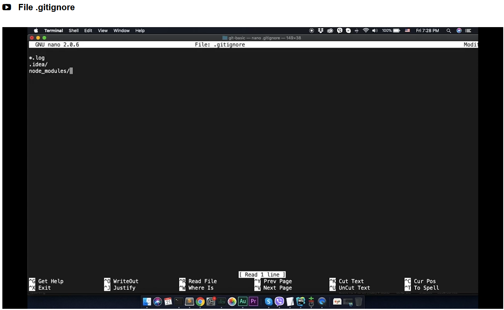
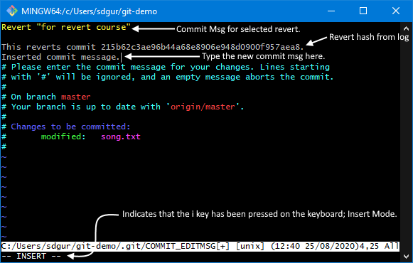
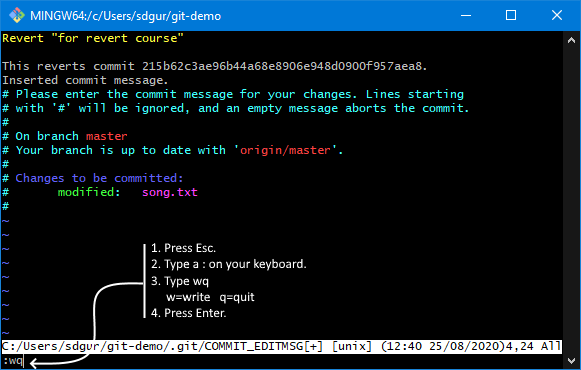
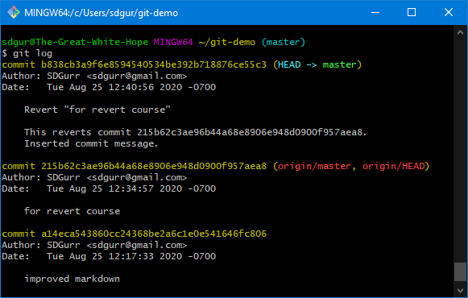

# Commands used in StackSkills Git Introductory Course

.gitignore {this is a file, denoted by the "." at the beginning}

- Create the .gitignore file by using the touch command
   $ touch .gititnore

- Edit the new file using the nano command
  $ nano .gititnore

- Enter these commands into the .gitignore file.
  \*.log {\# no log files}

  \!error.log {\# but do track error.log, even though you're ignoring .log files above}

  /TODO {\# only ignore the TODO file in the current directory, not subdir/TODO}

    build/ {\# ignore all file in the build/ directory}

  doc/*.txt {# ignore doc/notes.txt, but not doc/server/arch.txt}

    doc/**/*.pdf {# ignore all .pdf files int he doc/ directory}

  *Example:* 

cat {something}

- cat opens a file

  >cat {text file}
  >
  >- opens the text file and displays the text

  >cat HEAD
  >
  >- opens the head file in the .git folder

  >cat master
  >
  >- opens the master file in the .git folder
  >- see NOTE for git commit below.

  >cat index
  >
  >- opens the index file in the .git folder

cd ~users/

- ~~Must go out to the repository location on local machine...I think, one dir at a time.~~
- for directories that begin with a dot (.), e.g. .ssh or .git, you don't need the tilda (~)
- `cd {dir}` is all you need to open up the next directory.

cd ..

- This takes you back to the previous directory

dir

- lists content of current directory

git add

- add file to index (staging area)
- **NOTE:** You must add the file to the staging area (index) *before* you can commit the changes.
- adding a dot (.) after a space at the end of the `git add` command, e.g. `git add .` adds all the files in the directory.

git checkout -- file.txt

- checks out specified file from the repository. Replaces local files.

git checkout .

- checks out all files and all directories in/below the current dir

git clean -xdf

- delete all untracked files and directories
- -x = ignore rules for getting the file
- d = directory, meaning folders and what's inside
- f = force or forms...can't tell with the accent

git clone [URL or SSH]

- Retrieve an entire repository from a hosted location via URL or SSH.
- **NOTE:** Remember to initialize or reinitialize the target directory.

git commit

- commit file

  > git commit -m "commit messag"
  >
  > - commit file and include a commit message.

  > git commit --amend -m "commit message"
  >
  > - Replace the tip of the current branch by creating a new commit, but can be used to amend a merge commit

- **NOTE:** When you go to the .git folder (cd .git) and look at the master files, the number there is the number of the last commit.

git diff

- shows unstaged changes

git fetch

- will not download new content

git gui&

- opens Git Gui

git init

- creates an empty Git repository or reinitialize an existing one.
- use this when you add a new repository clone to an existing Git directory.

  - navigate to the folder and run `git init` in that folder.
  - when you create the new clone and save it to your local machine, this is the defaulted location.

gitk

- brings up a big-ass window
- shows history of all changes

git log

git log --pretty=oneline
  
- removes Author and Data lines and puts the hash and -m on a single line.

git ls-tree {commit token for tree}

- don't need entire commit token, just first 5 or so characters

git merge

git pull

- combines git fetch and git merge into one command

git reset -- file.txt

- returns files that have been staged to regular modified status.

git reset HEAD^^ (HEAD~2)

- the carrots (^) indicate the number of commits we need to go back

- (HEAD~2) if the number of commits needed to go back is large, use this instead of the carrots

git reset --soft HEAD~{number of commits back to go}

- can move files back to the index or file system
- the carrots (^) indicate the number of commits we need to go back
- (HEAD~2) if the number of commits needed to go back is large, use this instead of the carrots

git reset --mixed HEAD^{each ^ is 1 commit back to go}

- this is the default mode. can move a file directly back to the file system
- the carrots (^) indicate the number of commits we need to go back
- (HEAD~2) if the number of commits needed to go back is large, use this instead of the carrots

git reset --hard

- deletes changes completely. cannot restore.

git revert \<sha1>

- \<sha1> is the hash line for the commit you want to revert obtained from the git log command.- can type the entire hash OR just the first 5 letters.- opens a VERY OLD Unix text editor:
  - Press i on your keyboard to enter Insert mode then add the commit message (see screenshot in Markdown file).
      
  - When finished, press [esc], then : then wq (w = writer, q = quit). Press Enter (see second screenshot).
            
  - 
  - To escape the editor without adding a commit message, press [esc], then : then q!. Press Enter.

git show -s --pretty=raw {commit token}

- don't need entire commit token, just first 5 or so characters
- see **cat master** above

git show {commit token for blob}

- don't need entire commit token, just first 5 or so characters
- **NOTE:** The first two characters in the commit token are the folder name, the rest are the file name.

git status

- 

ls -l

- lists content of current directory

nano {text file}

- opens file in an editor. Remeber ^S to save and ^X to exit.

touch {file}

- add file to repository
- can include local path to the file if it isn't already in the local repository.
- doesn't seem to work. It's a Linux command so maybe that's why.
  - ==looks like it just creates empty files==, so you have to put content into them.

---------

blob = Binary Large OBject

[WORKING DIRECTORY]
git checkout -- file.txt

- checks out specified file from the repository. Replaces local files.

git checkout .

- checks out all files and all directories in/below the current dir

git clean -xdf

- delete all untracked files and directories
- -x = ignore rules for getting the file
- d = directory, meaning folders and what's inside
- f = force or forms...can't tell with the accent

[STAGING AREA (INDEX)]
git reset -- file.txt

- returns files that have been staged to regular modified status.

[LOCAL BRANCH]

git reset HEAD^^ (HEAD~2)

- the carrots (^) indicate the number of commits we need to go back
- (HEAD~2) if the number of commits needed to go back is large, use this instead of the carrots

git commit --amend -m "commit message"

- Replace the tip of the current branch by creating a new commit, but can be used to amend a merge commit

[REMOTE REPOSITORY]

git revert \<sha1>

---------

<https://git-scm.com>

<https://git-scm.com/downloads/guis>

<https://git-scm.com/docs>

<https://git-scm.com/book/en/v2/Git-on-the-Server-Generating-Your-SSH-Public-Key>
